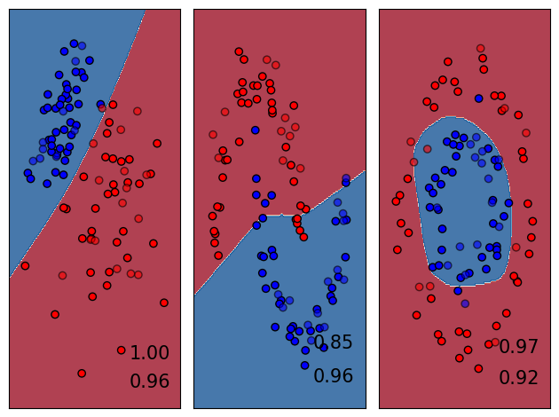
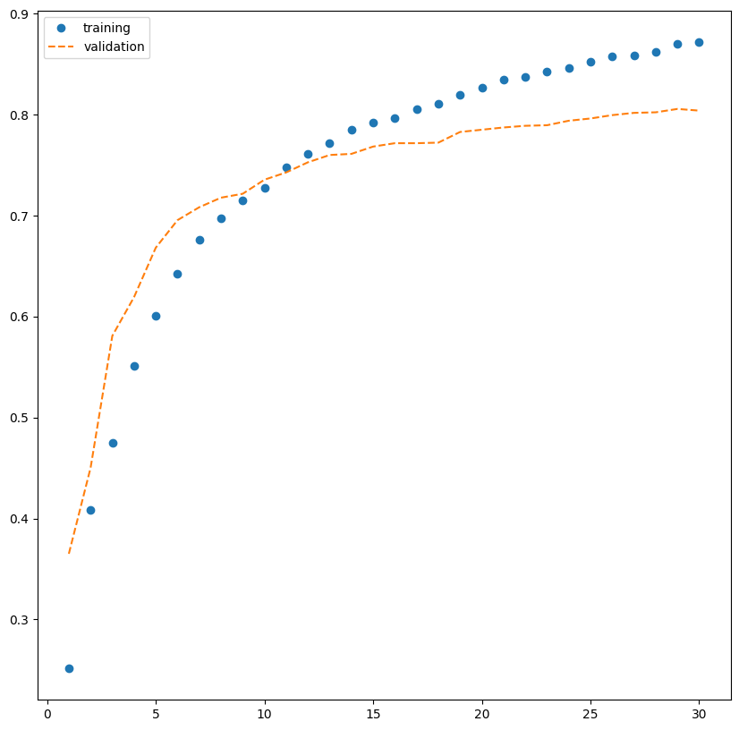
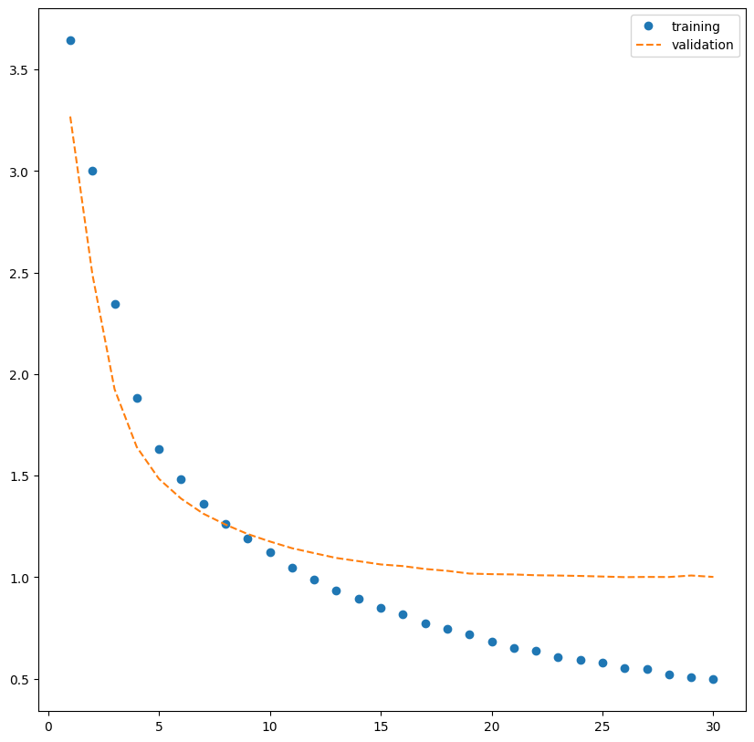

# Neural-Networks-Python-Keras
Multiple MLP models, designed to explore the fundamentals of neural networks

Here you can find:

#Binary Classification

#MultiClass Classification
Using the Routes dataset

